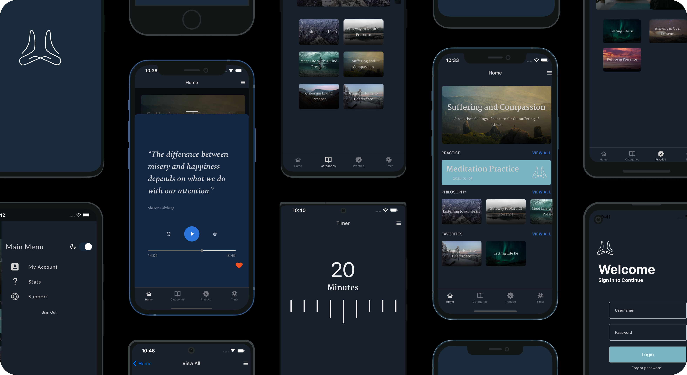

# Meditation App



This is app is built with [Expo](https://docs.expo.io/). It is heavily inspired by [Waking Up](https://wakingup.com/). Shout out to [Sam Harris](https://twitter.com/SamHarrisOrg?ref_src=twsrc%5Egoogle%7Ctwcamp%5Eserp%7Ctwgr%5Eauthor) and  [MetaLab](https://www.metalab.com/projects/waking-up) for building a great app. Also shout out to [Nader Dabit](https://twitter.com/dabit3?ref_src=twsrc%5Egoogle%7Ctwcamp%5Eserp%7Ctwgr%5Eauthor) for the idea of creating an Amplify "App in a box."

## Features

💻 Ready to deploy Serverless backend. 

💡 Light and Dark Mode

🎧  Audio Player

🔐 Authentication

📈 GraphQL

📦 Storage

## Deploy the back end and run the app


1. Clone the repo, install dependencies.

    ```bash
    ~ git clone https://github.com/jackburrus/MeditationApp.git

    ~ cd MeditationApp

    ~ yarn
    ```

2. Initialize and deploy Amplify Project.

    ```bash
    ~ amplify init

    ? Enter a name for the environment: dev (or whatever you would like to call this env)
    ? Choose your default editor: <YOUR_EDITOR_OF_CHOICE>
    ? Do you want to use an AWS profile? Y

    ~ amplify push

    ? Are you sure you want to continue? Y
    ? Do you want to generate code for your newly created GraphQL API? Y
    ```

3. Start the app.

    ```bash
    ~ expo start
    ```

## Populate database and add meditation files to storage.


1. Follow the authentication steps to create an AWS Cognito user, and login to the app.
2. Open the AppSync console.

    ```bash
    ~ amplify console api
    ```

3. Click on **Queries** to open the GraphiQL Editor. When prompted to "Login with User Pools", you can login with your new username and use the `aws_user_pools_web_client_id` located in **aws-exports.js** for the ClientId.
4. Create a new meditation with the following GraphQL mutation:

    ```graphql
    mutation createMeditation {
      createMeditation(input: {
        title: "Monkey Mind", 
        description: "A 20 minute meditation that aims to tame all these monkeys looking to steal your attention.", 
        imageSource: "https://images.unsplash.com/photo-1528715471579-d1bcf0ba5e83?ixid=MXwxMjA3fDB8MHxwaG90by1wYWdlfHx8fGVufDB8fHw%3D&ixlib=rb-1.2.1&auto=format&fit=crop&w=2870&q=80", 
        tag: "Philosophy"
    }) {
        id
        imageSource
        tag
        title
      }
    }
    ```

5. In the AWS console,  navigate to the S3 Storage bucket for your app.
6. Create a folder for your audio files under `public/audiofiles/`. Upload your .mp3 files to this bucket, and rename them with the AWS_ID associated to the API data, ie `294547d4-461d-4dc7-abea-4c6757d4231f.mp3`

## To customize with your theme.


This app uses [Restyle](https://github.com/Shopify/restyle) for many of its styles and light/dark mode. You can find the file under `src/theme/Theme`

## Customization


Change the schema under `amplify/backend/api/{YOUR_APP_NAME}/schema.graphql`

Redeploy to Amplify

```bash
~ amplify push
```
